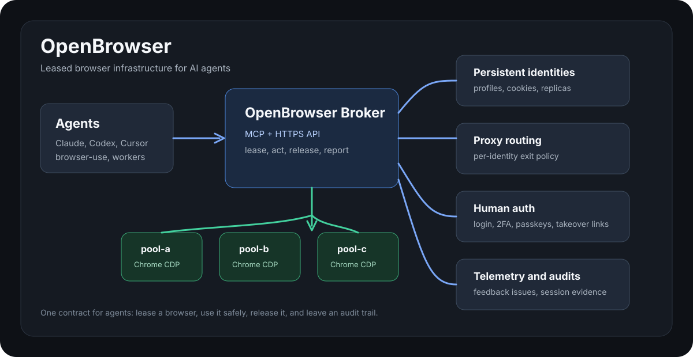
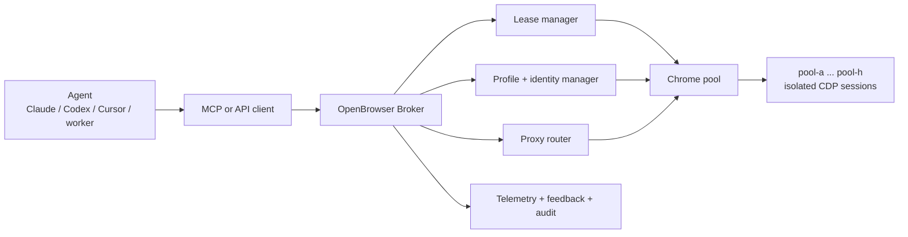
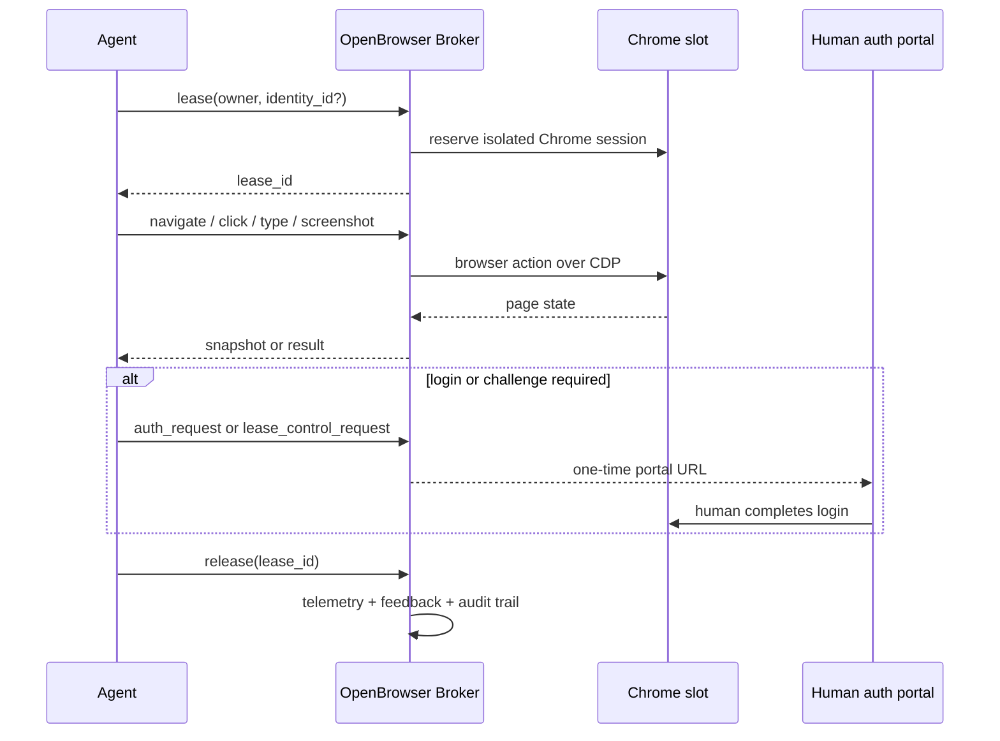
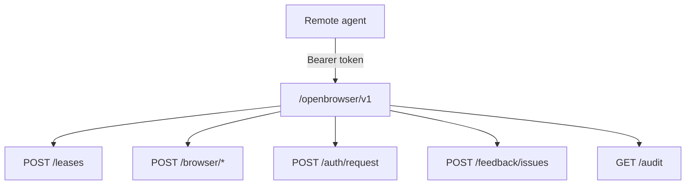
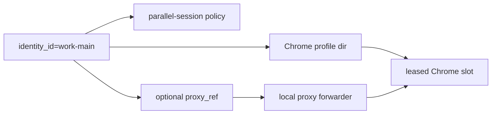

# OpenBrowser

[](LICENSE)
[](pyproject.toml)
[](docs/browser-routing.md)
[](docs/openbrowser-api.md)

[Website](https://browser.floom.dev) · [API docs](docs/openbrowser-api.md) · [Browser routing](docs/browser-routing.md)

OpenBrowser is browser infrastructure for AI agents: isolated Chrome sessions, persistent profiles, proxy-aware identities, human login handoff, a remote API, and MCP tools.

It lets Claude, Codex, Cursor, browser-use, OpenBrowser-style agents, and custom workers share real Chrome browsers without fighting over one CDP port. Agents lease a browser, use a named profile when account state is needed, route selected identities through proxies, hand login challenges to a human, and leave behind telemetry plus issue reports that can be audited later.





## Why

Most browser agents break in the same ways:

- several agents connect to the same Chrome instance and block each other
- logged-in sessions are tied to one fragile browser profile
- passwords and 2FA prompts become unsafe chat messages
- rich-text apps such as Slack, Discord, Notion, Linear, and X ignore DOM fill calls
- failures vanish into logs, so the next agent repeats the same mistake

OpenBrowser gives agents one operating contract: lease, act, release, report.

## Features

- **Browser pool**: multiple isolated Chrome slots with CDP endpoints managed behind one broker.
- **Persistent profiles**: named identities reuse Chrome profile directories and session cookies.
- **Profile replicas**: selected identities can run in parallel without Chrome profile-lock conflicts.
- **Fast QA routing**: pair OpenBrowser with disposable browser tools for public-page checks that do not need account state.
- **Proxy routing**: identities can pin traffic to an HTTP/SOCKS proxy via `proxy_ref`.
- **Remote API**: bearer-token protected `/openbrowser/v1` API for agents on any machine.
- **MCP servers**: local MCP for same-host agents and remote MCP for HTTPS-backed access.
- **Human auth handoff**: one-time portal links for login, 2FA, passkeys, and manual challenges.
- **Active lease control**: short-lived manual control links for a browser tab already held by an agent.
- **Rich-text keyboard tools**: real keyboard events for editors that reject simple DOM value changes.
- **Telemetry and issues**: sanitized events, feedback issue tracking, and usage audits.
- **browser-use and OpenBrowser adapters**: wrappers lease a slot, run the tool, then release the slot.

## Use Cases

| Use case | OpenBrowser gives you |
| --- | --- |
| Remote browser automation | HTTPS API and remote MCP for agents running on other machines. |
| Logged-in workflows | Named Chrome identities with persisted profile state. |
| Multi-agent work | Lease isolation so parallel agents do not steal each other's tabs. |
| Account-specific routing | Per-identity proxy refs, locale, timezone, and profile policy. |
| Human-in-the-loop auth | One-time portal links for passwords, 2FA, passkeys, and manual checks. |
| Debuggable automation | Sanitized telemetry, native feedback issues, and session-log audits. |

## Architecture



## Quick Start

### Python

```bash
git clone https://github.com/floomhq/openbrowser.git
cd openbrowser
python3 -m venv .venv
. .venv/bin/activate
pip install -e .
playwright install chromium
cp .env.example .env
cp config/identities.example.json config/identities.local.json
```

Start the broker:

```bash
openbrowser-broker
```

### Docker

```bash
git clone https://github.com/floomhq/openbrowser.git
cd openbrowser
OPENBROWSER_API_KEYS="$(openssl rand -base64 48)" docker compose up --build
```

Lease a browser:

```bash
curl -fsS http://127.0.0.1:8767/lease \
  -H "content-type: application/json" \
  -d '{"owner":"demo","ttl_seconds":300}'
```

Use the returned `lease_id`:

```bash
curl -fsS http://127.0.0.1:8767/browser/navigate \
  -H "content-type: application/json" \
  -d '{"lease_id":"<lease_id>","url":"https://example.com"}'

curl -fsS http://127.0.0.1:8767/browser/snapshot \
  -H "content-type: application/json" \
  -d '{"lease_id":"<lease_id>"}'

curl -fsS -X POST http://127.0.0.1:8767/release/<lease_id>
```

## Remote API

Expose the broker behind your HTTPS proxy or tunnel and configure:

```bash
OPENBROWSER_API_KEYS="your-long-random-api-key"
OPENBROWSER_PUBLIC_OPENBROWSER_BASE_URL="https://browser.example.com/openbrowser/v1"
```

Then call:

```bash
BASE=https://browser.example.com/openbrowser/v1
KEY=your-long-random-api-key

curl -fsS "$BASE/docs" \
  -H "authorization: Bearer $KEY" \
  -H "user-agent: openbrowser-client/1.0"
```

The API covers leases, navigation, snapshots, screenshots, clicks, typing, keyboard events, tabs, auth handoff, lease control, profiles, feedback issues, telemetry, and audits.



## MCP

Local MCP, for agents running on the broker host:

```json
{
  "mcpServers": {
    "openbrowser-broker": {
      "command": "openbrowser-mcp"
    }
  }
}
```

Remote MCP, for agents running anywhere:

```json
{
  "mcpServers": {
    "openbrowser-remote": {
      "command": "openbrowser-remote-mcp",
      "env": {
        "OPENBROWSER_API_KEY": "<OPENBROWSER_API_KEY>",
        "OPENBROWSER_BASE_URL": "https://browser.example.com/openbrowser/v1"
      }
    }
  }
}
```

Core MCP tools:

- `browser_lease`, `browser_release`, `browser_heartbeat`
- `browser_navigate`, `browser_snapshot`, `browser_screenshot`
- `browser_click`, `browser_type`, `browser_keyboard_type`, `browser_keyboard_press`
- `browser_tabs`, `browser_new_tab`, `browser_switch_tab`, `browser_wait`
- `auth_request`, `auth_status`, `lease_control_request`
- `feedback_report_issue`, `feedback_list_issues`, `feedback_update_issue`
- `telemetry_record_event`, `telemetry_list_events`, `telemetry_summary`
- `broker_audit`, `broker_docs`, `profile_status`

## Persistent Profiles

Identities are configured in `config/identities.local.json`:

```json
{
  "identities": {
    "work-main": {
      "label": "Work account",
      "site": "example.com",
      "slot": "auto",
      "profile_dir": "/var/lib/openbrowser-broker/profiles/work-main",
      "proxy_ref": "residential:work-main",
      "timezone": "America/New_York",
      "lang": "en-US",
      "policy": {
        "max_parallel_sessions": 1,
        "requires_human_auth": true
      }
    }
  }
}
```

When an identity needs login:

```bash
curl -fsS "$BASE/auth/request" \
  -H "authorization: Bearer $KEY" \
  -H "content-type: application/json" \
  -d '{"owner":"setup","identity_id":"work-main","url":"https://example.com/login","reason":"initial_login"}'
```

Open the returned `portal_url`, complete login in the browser view, then mark the request complete. Future leases for that identity reuse the saved profile state.

For parallel work, set `policy.max_parallel_sessions` above `1`. OpenBrowser then seeds per-slot replicas instead of starting multiple Chrome processes against one profile directory. That matters: several windows in a desktop Chrome profile are one Chrome process, but several server-side agents are independent Chrome processes. Directly sharing the same `profile_dir` across those processes risks Chrome singleton-lock failures and profile database corruption.



## Proxy Routing

Add proxy credentials in `secrets/proxies.json`:

```json
{
  "proxies": {
    "residential:work-main": {
      "scheme": "http",
      "host": "proxy.example.net",
      "port": 12345,
      "username": "user",
      "password": "pass"
    }
  }
}
```

Then set `"proxy_ref": "residential:work-main"` on the identity. The broker starts a local proxy forwarder and launches Chrome with the matching proxy for that profile.

## Safety Model

- Raw cookies, passwords, tokens, proxy credentials, and VNC passwords are never returned by tools.
- Telemetry redacts sensitive keys and secret-shaped strings.
- Browser typing telemetry stores text length, not typed text.
- Login and challenge handling use human handoff portals instead of secrets in chat.
- CAPTCHA solving and ban-circumvention automation are outside the project boundary.

## What This Is Not

- Not a CAPTCHA solver.
- Not a token extractor.
- Not a shared global Chrome tab for every agent.
- Not a scraping bypass toolkit.
- Not a replacement for product APIs when a stable API exists.

## Operations

```bash
openbrowser-audit --json
openbrowser-use --json open https://example.com
openbrowser status
openbrowser docs quickstart
```

Systemd examples live in `systemd/`. Detailed runbooks live in `docs/`.

## Development

```bash
python3 -m compileall ax_browser_broker tests
pytest -q
```

## Project Status

OpenBrowser is an alpha public release of production-oriented browser infrastructure. The core lease manager, profile identities, remote API, MCP surfaces, human auth handoff, telemetry, feedback issues, audits, and adapter wrappers are covered by tests. New deployments can use the generic commands and environment variables above; legacy `ax-*` command wrappers remain for existing installations.

## License

MIT
