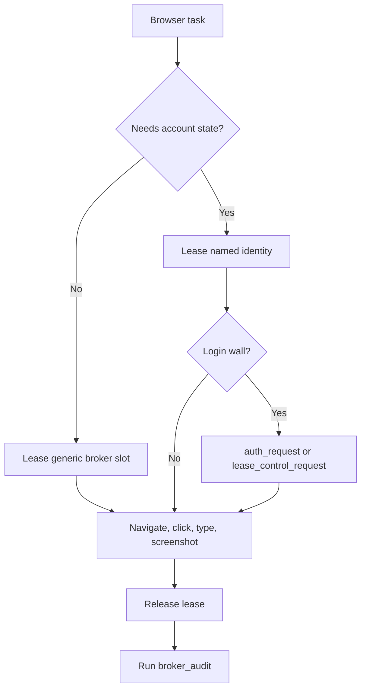

# Browser Routing

This is the canonical routing guide for agents using OpenBrowser Broker.



## Routes

| Route | Use For | Start |
| --- | --- | --- |
| Broker MCP | Normal browser agents, authenticated identities, concurrent sessions, feedback, telemetry, audits | `broker_docs`, `browser_lease`, `browser_release`, `broker_audit` |
| Remote MCP | Agents running outside the browser host | `openbrowser-remote-mcp` with `OPENBROWSER_API_KEY` and `OPENBROWSER_BASE_URL` |
| OpenBrowser wrapper | OpenBrowser diagnostics and OpenBrowser MCP surface | `openbrowser-adapter --identity <id> ...` |
| browser-use wrapper | browser-use task execution against broker-leased browsers | `openbrowser-use --identity <id> ...` |
| Fast disposable browser | Anonymous QA, local dev-server screenshots, public pages, no account state | gstack `/browse` or another disposable-browser command |

## Rules

1. Lease before browser work.
2. Use identities only when account state or proxy routing is required.
3. Use `auth_request` for login, passkeys, 2FA, or password entry.
4. Use `lease_control_request` when a human must control the currently leased tab.
5. Release every lease.
6. Run `broker_audit` after browser-agent work.
7. Do not connect custom scripts directly to raw pool CDP ports during normal agent work.

## Identities

`config/identities.local.json` maps identity names to profile directories, proxy refs, locale, timezone, and parallel-session policy.

```bash
openbrowser-adapter --identity work-main status
openbrowser-use --identity work-main --json open https://example.com
```

When `policy.max_parallel_sessions` is greater than one, parallel leases use per-slot replicas under `profiles/.replicas/<identity>/<slot>`.

Do not launch several independent Chrome processes against the same `profile_dir`. Chrome profile locks, SQLite databases, and local state files are single-writer resources. On a laptop, several Chrome windows for the same profile still belong to one Chrome process; on the broker, separate agents normally receive separate Chrome processes.

Use these identity concurrency modes:

| Mode | Use For | Tradeoff |
| --- | --- | --- |
| Single canonical lease | Login, settings changes, sensitive account actions | Strongest persistence; one lease owner at a time; that owner can open multiple tabs |
| Profile replicas | Parallel read/QA/background flows with the same seeded identity | Independent slots; sessions can diverge until replicas are refreshed |
| Shared live browser coordinator | Future mode for several agents attached to one running Chrome process | Not the default lease contract; needs focus/navigation arbitration |

The default contract is a single canonical lease unless the identity explicitly opts into replicas with `policy.max_parallel_sessions`.

`max_parallel_sessions` is a policy cap, not a Chrome feature cap. The hard broker cap is the configured slot count. The default pool has eight slots (`pool-a` through `pool-h`), and each live Chrome slot consumes CPU, RAM, profile disk I/O, and possibly a proxy lane. Keep high-risk identities lower than the pool maximum unless the task explicitly needs more parallelism.

## Fast QA Lane

Use gstack `/browse` for public pages, local dev-server checks, screenshots, and fast UI assertions that do not need Federico's account state. It is intentionally disposable and optimized for quick verification.

Use OpenBrowser Broker for persisted profiles, cookies, proxy-backed identities, login handoffs, rich-text keyboard events, telemetry, feedback issues, and auditable multi-agent browser work. The two routes are complementary: fast disposable browser for anonymous QA, OpenBrowser for anything authenticated or identity-sensitive.

## Profile Import

Chrome profile metadata can be mirrored from a workstation into broker identities. Raw cookies, passwords, tokens, and keychain-backed browser databases are excluded. Website login state is established through human auth handoff or Chrome Sync.

See `docs/mac-chrome-profiles.md`.
