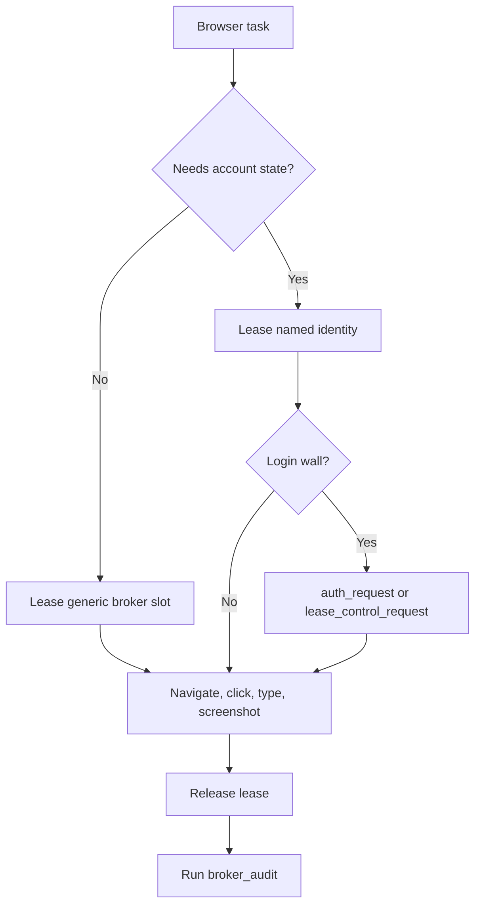

# Browser Routing

This is the canonical routing guide for agents using OpenBrowser Broker.



## Routes

| Route | Use For | Start |
| --- | --- | --- |
| Broker MCP | Normal browser agents, authenticated identities, concurrent sessions, feedback, telemetry, audits | `broker_docs`, `browser_lease`, `browser_release`, `broker_audit` |
| Remote MCP | Agents running outside the browser host | `openbrowser-remote-mcp` with `OPENBROWSER_API_KEY` and `OPENBROWSER_BASE_URL` |
| OpenBrowser wrapper | OpenBrowser diagnostics and OpenBrowser MCP surface | `openbrowser-adapter --identity <id> ...` |
| browser-use wrapper | browser-use task execution against broker-leased browsers | `openbrowser-use --identity <id> ...` |
| Disposable browser | Anonymous QA, local dev-server screenshots, public pages, no account state | Tool-specific disposable browser command |

## Rules

1. Lease before browser work.
2. Use identities only when account state or proxy routing is required.
3. Use `auth_request` for login, passkeys, 2FA, or password entry.
4. Use `lease_control_request` when a human must control the currently leased tab.
5. Release every lease.
6. Run `broker_audit` after browser-agent work.
7. Do not connect custom scripts directly to raw pool CDP ports during normal agent work.

## Identities

`config/identities.local.json` maps identity names to profile directories, proxy refs, locale, timezone, and parallel-session policy.

```bash
openbrowser-adapter --identity work-main status
openbrowser-use --identity work-main --json open https://example.com
```

When `policy.max_parallel_sessions` is greater than one, parallel leases use per-slot replicas under `profiles/.replicas/<identity>/<slot>`.

## Profile Import

Chrome profile metadata can be mirrored from a workstation into broker identities. Raw cookies, passwords, tokens, and keychain-backed browser databases are excluded. Website login state is established through human auth handoff or Chrome Sync.

See `docs/mac-chrome-profiles.md`.
