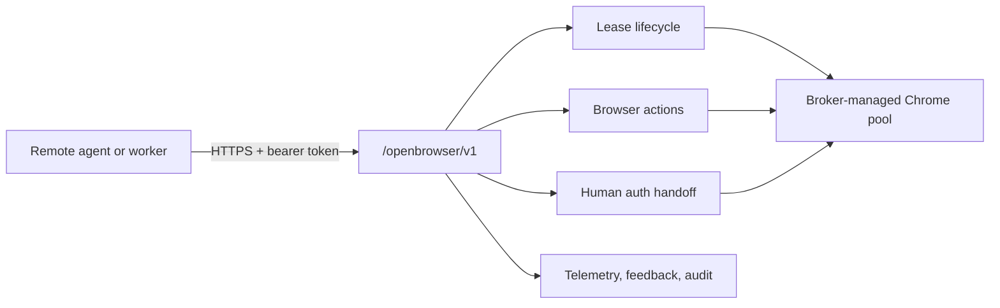
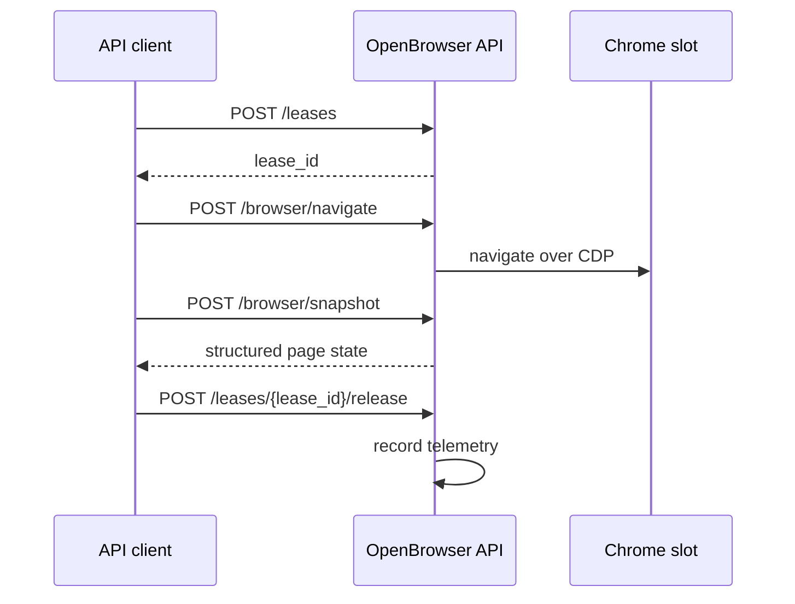
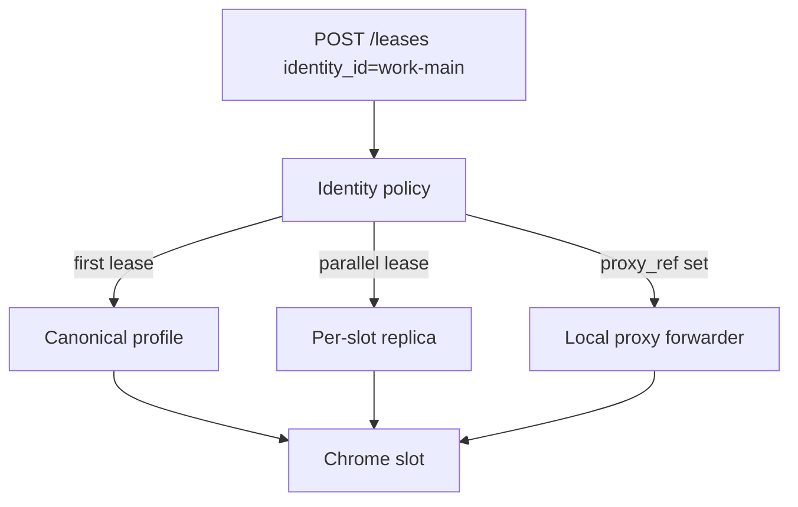

# OpenBrowser Remote API

OpenBrowser Broker exposes a bearer-token protected API for remote browser automation. It uses the same leased browser pool, identities, auth handoff, telemetry, feedback issues, and audit system as the MCP server.



Base URL:

```text
https://browser.example.com/openbrowser/v1
```

Authentication:

```text
Authorization: Bearer <OPENBROWSER_API_KEY>
```

Keys are loaded from `OPENBROWSER_API_KEYS`, `AX_OPENBROWSER_API_KEYS`, or `secrets/openbrowser_api_keys.json`.

Use a normal API client user agent such as `openbrowser-client/1.0`, `curl`, or your app's own product user agent.

## Core Flow



```bash
BASE=https://browser.example.com/openbrowser/v1
KEY=your-long-random-api-key

LEASE="$(
  curl -fsS "$BASE/leases" \
    -H "authorization: Bearer $KEY" \
    -H "user-agent: openbrowser-client/1.0" \
    -H "content-type: application/json" \
    -d '{"owner":"remote-smoke","ttl_seconds":300}'
)"

LEASE_ID="$(printf '%s' "$LEASE" | jq -r '.lease_id')"

curl -fsS "$BASE/browser/navigate" \
  -H "authorization: Bearer $KEY" \
  -H "user-agent: openbrowser-client/1.0" \
  -H "content-type: application/json" \
  -d "{\"lease_id\":\"$LEASE_ID\",\"url\":\"https://example.com\"}"

curl -fsS "$BASE/browser/snapshot" \
  -H "authorization: Bearer $KEY" \
  -H "user-agent: openbrowser-client/1.0" \
  -H "content-type: application/json" \
  -d "{\"lease_id\":\"$LEASE_ID\"}"

curl -fsS -X POST "$BASE/leases/$LEASE_ID/release" \
  -H "authorization: Bearer $KEY" \
  -H "user-agent: openbrowser-client/1.0"
```

## One-Shot Open

`POST /openbrowser/v1/open` leases a browser and navigates it in one request. It returns the lease; callers still release it.

```bash
curl -fsS "$BASE/open" \
  -H "authorization: Bearer $KEY" \
  -H "user-agent: openbrowser-client/1.0" \
  -H "content-type: application/json" \
  -d '{"owner":"remote-smoke","url":"https://example.com","ttl_seconds":300}'
```

## Identities

Pass `identity_id` only when account state or proxy routing is required.

- Omit `identity_id` for generic public-page QA.
- Use an identity such as `work-main` for a persisted logged-in Chrome profile.
- Use `policy.max_parallel_sessions` to control replica sessions for an identity.
- Use `proxy_ref` to route an identity through a configured proxy.

Generic leases never expose personal profile state. If all neutral slots are busy, the allocator can recycle an idle identity slot back to its neutral pool profile, then reactivate the identity on demand later.

Identity capacity is controlled by `policy.max_parallel_sessions` in `config/identities.local.json`. When a Chrome identity allows more than one session, the first lease uses the canonical logged-in profile and later parallel leases use per-slot replicas under `profiles/.replicas/<identity>/<slot>`. This avoids Chrome profile-lock conflicts while keeping the original logged-in profile intact.



List available identities:

```bash
curl -fsS "$BASE/identities" \
  -H "authorization: Bearer $KEY" \
  -H "user-agent: openbrowser-client/1.0"
```

Start a human login handoff for a persisted identity:

```bash
curl -fsS "$BASE/auth/request" \
  -H "authorization: Bearer $KEY" \
  -H "user-agent: openbrowser-client/1.0" \
  -H "content-type: application/json" \
  -d '{"owner":"profile-login","identity_id":"work-main","url":"https://example.com/login","reason":"profile_login"}'
```

Open the returned `portal_url`, sign in inside the browser view, then mark it complete in the portal. Future leases for that `identity_id` reuse the persisted browser state.

Generate several identity login links at once:

```bash
curl -fsS "$BASE/auth/batch" \
  -H "authorization: Bearer $KEY" \
  -H "user-agent: openbrowser-client/1.0" \
  -H "content-type: application/json" \
  -d '{"owner":"profile-login","identity_ids":["work-main","qa-generic"],"url":"https://example.com/login","reason":"profile_login"}'
```

## Endpoints

- `GET /health`
- `GET /docs`
- `GET /identities`
- `GET /auth/status`
- `GET /audit`
- `GET /profiles/status`
- `POST /auth/request`
- `POST /auth/batch`
- `POST /leases`
- `POST /leases/{lease_id}/release`
- `POST /leases/{lease_id}/heartbeat`
- `POST /open`
- `POST /browser/navigate`
- `POST /browser/snapshot`
- `POST /browser/screenshot`
- `POST /browser/click`
- `POST /browser/type`
- `POST /browser/keyboard-type`
- `POST /browser/keyboard-press`
- `POST /lease-control/request`
- `POST /browser/wait`
- `POST /browser/tabs`
- `POST /browser/new-tab`
- `POST /browser/switch-tab`
- `GET /feedback/issues`
- `POST /feedback/issues`
- `POST /feedback/issues/{issue_id}`
- `POST /telemetry/events`
- `GET /telemetry/events`
- `GET /telemetry/summary`

## Remote MCP

Agents on other machines can use the same public API through a stdio MCP server:

```json
{
  "mcpServers": {
    "openbrowser-remote": {
      "command": "openbrowser-remote-mcp",
      "env": {
        "OPENBROWSER_API_KEY": "<OPENBROWSER_API_KEY>",
        "OPENBROWSER_BASE_URL": "https://browser.example.com/openbrowser/v1"
      }
    }
  }
}
```

The remote MCP exposes browser leasing/actions, auth handoff, profile status, feedback issue reporting, telemetry, and audit tools. It is a client-side MCP process: the agent launches it locally, and it calls the HTTPS OpenBrowser API with bearer auth.

## Safety

The API never exposes cookies, passwords, raw tokens, proxy credentials, or VNC passwords. Human login remains under `/auth/<token>` and noVNC remains temporary.

Opening an auth portal starts or reuses the noVNC login view by default. Set `OPENBROWSER_AUTH_TRUSTED_CIDRS` to allow passwordless noVNC connection for specific operator IPs or CIDR ranges. Set `OPENBROWSER_AUTH_TRUST_X_FORWARDED_FOR=1` only behind a trusted reverse proxy that overwrites `X-Forwarded-For`.

Use telemetry-only records for expected negative test cases and normal app validation failures. File feedback issues for broker, identity/proxy, auth handoff, upload, screenshot, keyboard, or adapter failures that block the task.

## Active Lease Human Control

If a leased headless browser hits a prompt that must be handled in the current tab, create a short-lived manual control link:

```bash
curl -fsS "$BASE/lease-control/request" \
  -H "authorization: Bearer $KEY" \
  -H "user-agent: openbrowser-client/1.0" \
  -H "content-type: application/json" \
  -d "{\"lease_id\":\"$LEASE_ID\",\"owner\":\"human-handoff\",\"ttl_seconds\":900}"
```

Open the returned `portal_url`. The page shows fresh screenshots and lets the human click or type into the existing tab. It is a manual handoff surface, not an automated CAPTCHA solver.

## Rich-Text Editors

Modern editors such as Discord, Slack, Notion, Linear, and X often ignore DOM value changes. Use real keyboard events for those surfaces:

```bash
curl -fsS "$BASE/browser/keyboard-type" \
  -H "authorization: Bearer $KEY" \
  -H "user-agent: openbrowser-client/1.0" \
  -H "content-type: application/json" \
  -d "{\"lease_id\":\"$LEASE_ID\",\"selector\":\"div[role=\\\"textbox\\\"]\",\"text\":\"hello\"}"

curl -fsS "$BASE/browser/keyboard-press" \
  -H "authorization: Bearer $KEY" \
  -H "user-agent: openbrowser-client/1.0" \
  -H "content-type: application/json" \
  -d "{\"lease_id\":\"$LEASE_ID\",\"key\":\"Enter\"}"
```

`POST /browser/type` also detects contenteditable or non-input `role=textbox` elements and uses keyboard events automatically. On normal inputs and textareas it keeps the existing fill behavior.
