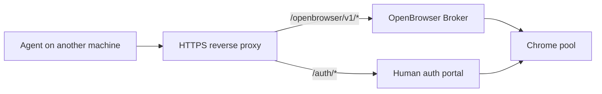

# Operations

## Start

```bash
openbrowser-broker
```

The default API listens on `127.0.0.1:8767`.

## Public API

Put the broker behind HTTPS and set:

```bash
OPENBROWSER_API_KEYS="your-long-random-api-key"
OPENBROWSER_PUBLIC_AUTH_BASE_URL="https://browser.example.com"
OPENBROWSER_PUBLIC_OPENBROWSER_BASE_URL="https://browser.example.com/openbrowser/v1"
```

Expose only the routes needed by your deployment. For public agent access, use `/openbrowser/v1/*`. For human login handoff, use `/auth/*`.



## Proxy Check

```bash
openbrowser-adapter --identity work-main status
openbrowser-use --identity work-main --json open 'https://api.ipify.org?format=json'
```

The identity's `proxy_ref` determines whether Chrome exits through a proxy.

## Audit

```bash
openbrowser-audit --json
```

Audit checks telemetry, feedback issues, active leases, and session logs. A clean broker has no unexpected active leases and no untriaged browser failures.

## Feedback Rules For Agents

- Use telemetry-only records for expected negative tests and app-level validation failures.
- File a feedback issue when browser infrastructure blocks the task.
- Never include passwords, cookies, tokens, proxy credentials, or private screenshots in issue details.

## Rollback

If a browser pool change breaks agents:

1. Stop the broker service.
2. Stop or restart affected Chrome pool processes.
3. Restore the previous config file.
4. Start the broker.
5. Run `openbrowser-audit --json`.
